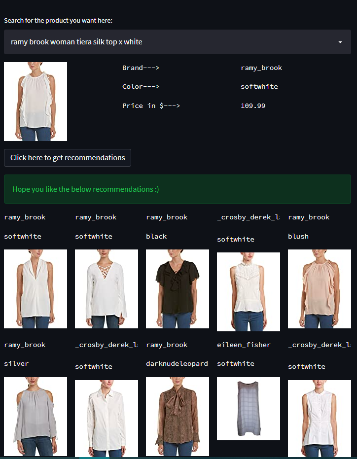
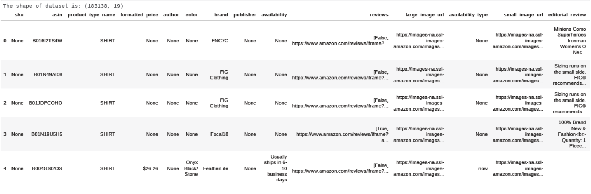
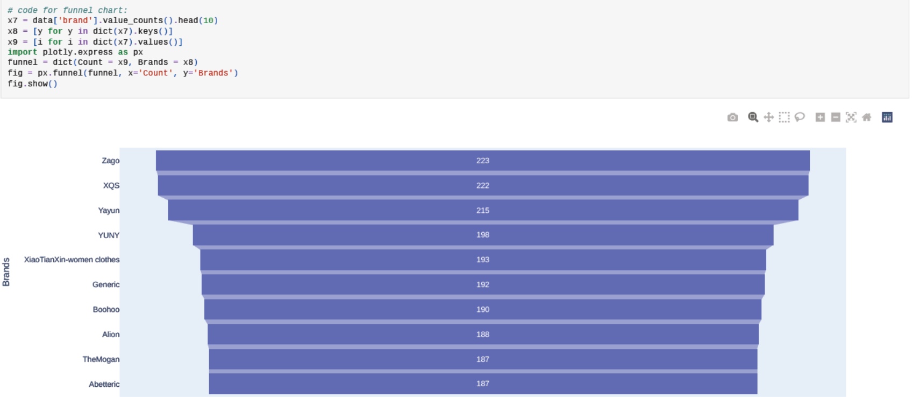
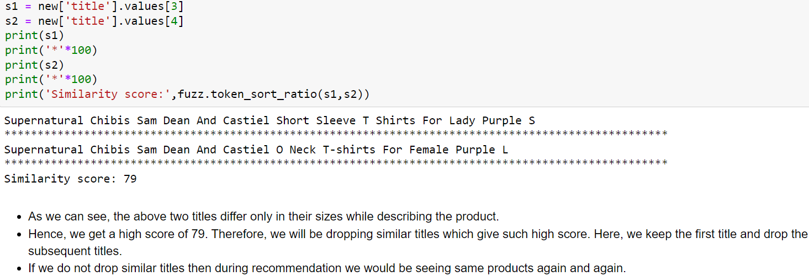
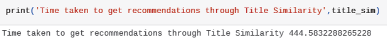
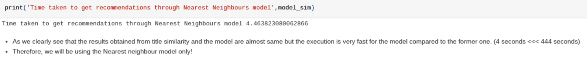

# Amazon Fashion Recommendation System

Online shopping can save time for both the buyer and retailer, reducing phone calls about availability, specifications, hours of operation or other information easily found on company and product pages. There are a lot of reasons why customers today prefer shopping online: 

1) Convenience.
2) Price comparisons.
3) You can send gifts more easily.
4) No need to travel.

---

The model developed in this project is based on 'Item-Item' similarity. Here, the products are recommended
based on the item that the user is currently seeing and doesn't take into account what his/her previous shopping habits have been.

I have made 2 models for Recommendations which consider :
1) Title similarity and cosine distance.
2) Unsupervised learning algorithm (Nearest Neighbours).

Find more details about the model in Models section below :)

## Acknowledgements

 - [How Amazon's recommendation works](https://recostream.com/blog/amazon-recommendation-system)
 - [Similar Dataset Source](http://jmcauley.ucsd.edu/data/amazon/)

## Demo screenshot

## Demo

- [Click here to see Demo](https://fashion-recommendation-full.herokuapp.com/)

## Data Overview

The dataset contains : 183138 rows, 19 features.

Here, we only consider the features which help us in giving sensible recommendations.

1) _product_type_ 
2) _formatted_price_
3) _color_
4) _brand_ 
5) _title_
6) _image_url_

## Data Visualisation Tools

⚪Bar plot (color)
⚪Pie chart (product)

⚪Funnel chart (brand)

⚪PDF (price)

These tools give us an idea about the distribution,structure of the data and frequency of categorical features.
  
## Data Cleaning

⚪Missing Values: 

Price: This feature has majority values as missing and since it is an important
feature we drop the rows having missing values. Because if we were to do mean imputation it would result into
false representation of the data because we are imputing on small data.

⚪Cleaning categorical feature:

- We remove special characters, numeric values and punctuations.

- We replace the empty spaces by empty string and join two words with an underscore (_).
- Nan values are filled by considering the value which occurs most frequently under a particular feature.
- There are strings present for 'price' we replace it by the value (0).

⚪Cleaning Text data:

- Dropping the duplicate titles.
- Removing Stopwords, punctuations, numeric values.
- Applying lemmatization to return dictionary form of words.

## Data preprocessing

⚪ One hot encoding on categorical features:

                   (Product_type, color, brand)

⚪ TFIDF vectorization on text data:

                            Product titles

⚪ Removing similar titles:

- For judging title similarity we have used the *fuzzy-wuzzy* library where, for any given two strings it returns a value between (0-100). 
- Higher value implies that the two strings are very similar. 
- We have used the *token sort ratio* here to know about the similarity.
- [Fuzzywuzzy library](https://www.geeksforgeeks.org/fuzzywuzzy-python-library/)
- Below we see how this library works!

- We define a function which gives us indexes of most similar titles for a given title.
- We remove the titles with the help of these indexes.

## Models

⚪ Model I (Recommendations through title similarity)

- We vectorize the product titles by applying TFIDF
- Define a function which returns cosine similarity value (0-1) for two such given vectors.
- For a given title, we calculate cosine similarity with every other titles and select top 10 highest values and return their indexes.
- These 10 indexes then help us to fetch 10 recommendations that we need to make.
- We display the result by defining  a function which shows images when a URL is given as input to it.

⚪ Model II (Using Nearest Neighbours algorithm)

- We first train only the title feature to see if this algorithm gives good recommendations.
- It was confirmed that the above model is indeed good and hence we use other features as well to train the model.
- By using the *(model.kneighbours)* attribute we get distances between vectors and the indexes of (k) similar points which would be our recommendations.
- We get URL corresponding to these indexes and feed it to the defined function to display our results.

## Results

- Although we get approximately similar recommendations by both the Models I & II, the execution time for Model I is much more than Model II.
- Below is snapshot of the execution time: 

⚪ For Title Similarity:

⚪ For Nearest Neighbours:

- By adding more features we defintely get more sensible recommendations for our products, as it also takes into account the *brand, color, product type* of the product that we are currently seeing.
## 🛠 Skills
Python, Streamlit, Heroku

